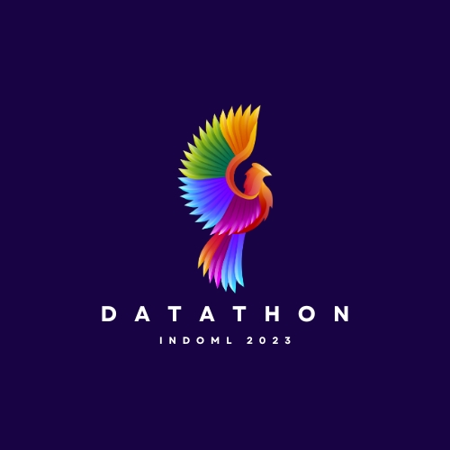

# IndoML Datathon 2023: Starter Kit
based on materials from the tutorial by [@bsantraigi](https://github.com/bsantraigi/2023-IndoML-Datathon-Tutorial), titled Intent Detection: From Sesame Street to LLMs. 
Tutorial video available here: https://www.youtube.com/watch?v=L3fa8Frmqro

#IndoML-2023 #Datathon 

## TLDR: Important dates and steps

- 👉 Register: https://docs.google.com/forms/d/e/1FAIpQLSfOnpG-7fgthBSTAJS7UnF3m57fPCbvtwpAt1JWoBjUbUyvXA/viewform
- 🤼 Data and Competition portal at: https://codalab.lisn.upsaclay.fr/competitions/14977
- ⏲️ Submit predictions at the portal
- 🗓️ Submission at portal begins on **2nd october**
- 🗓️ Competition Deadline: **12th October**
- 🏆 Win prizes worth INR 1 Lakhs

## A quick recipe to get you upto speed
1. Get a model finetuned for intent detection, say on the MASSIVE dataset ➞ https://huggingface.co/models?dataset=dataset:AmazonScience%2Fmassive&sort=trending
2. Finetune  the model on our training dataset ➞  
3. Obtain the predictions and submit

### Data
- Training data: <>
- Test data: TO be released on Oct 2

## A lazy approach with prompts
1. LLM_ShortPrompt.ipynb ➞ 
2. Obtain the predictions

## Notebooks

1. EDA.ipynb ➞ 

2. TransformerFinetune.ipynb ➞ 

3. LLM_ShortPrompt.ipynb ➞ 

## Tutorial

In the online tutorial we will go over the notebooks of this repo. We focus on the [AmazonScience/MASSIVE](https://huggingface.co/datasets/AmazonScience/massive) multilingual intent-detection. 

There are few different parts to the tutorial:

1. EDA.ipynb: We first explore the dataset a bit to understand the task and various stats about the data. We also get to see how to use the `datasets` library from HuggingFace, what metadata information is available, and how to apply preprocessing to the data.
2. FinetuneTransformer.ipynb: We then finetune a transformer model on the dataset. We use the `Trainer` class from HuggingFace to do this. 
3. LLM_PromptEngineering.ipynb: We then explore the use of LLMs for intent detection. We explore an in-context learning method to solve the task using a instruction-finetuned large-language model (LLM), without any finetuning.

There are also a few other bonus scripts available that showcases the use of other advanced techniques like parameter efficient tuning and low-rank adaptation methods. These methods will be useful for the datathon, to tackle the few-shot challenge in later phases and running on GPU devices available through Colab.

## Where to get free GPU resources?

Best options are Kaggle Notebooks and Google Colab.

## Other Links

* Nice blog about training very large models (Falcon-7b!) on Colab: [The Falcon has landed in the Hugging Face ecosystem](https://huggingface.co/blog/falcon)
    * Colab Link: [Finetuning Falcon-7b](https://colab.research.google.com/drive/1BiQiw31DT7-cDp1-0ySXvvhzqomTdI-o?usp=sharing)

